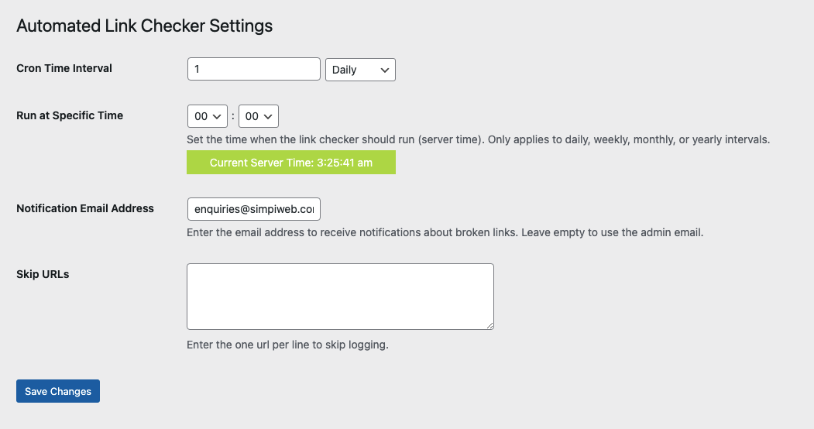
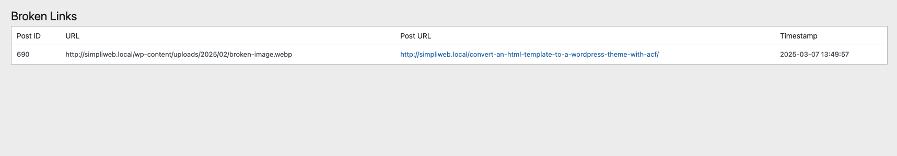

# Automated Link Checker
Automatically checks for broken internal and external links, images and PDFs.

## Description
The plugin checks all values in the posts and post_meta table for any anchors. It then checks if the url returns an error and logs it. Media logged are 'jpg', 'jpeg', 'png', 'gif', 'bmp', 'webp' and 'pdf' formats.

The log is stored in a custom table called alc_broken_links and when the cron runs it dumps all entries in the table so as to refresh only with current broken links.

The cron created is called alc_check_broken_links.

## Settings
In Admin -> Broken Links -> Settings you can set the following options

- **Cron Time Interval** - set the frequency to run the link check (default is 1 Daily)
- **Notification Email Address** - set the email address to send notifications to (default is admin email)
- **Skip URLs** - option to set urls you do not want logged, handy for urls behind logins or just do not want to worry about

## Viewing
In Admin -> Broken Links is a table of all broken links with the following columns
- **Post ID** - The ID of the post/page the broken link is used
- **URL** - The broken link
- **Post URL** - The url to the post/page the broken link is on (opens in new tab)
- **TImestamp** - The timestamp for when the link was logged

## Manually Running
To manuall run the cron you will need to use a plugin like [WP Crontrol](https://wordpress.org/plugins/wp-crontrol/). Then you can search for the alc_check_broken_links cron and select Run Now